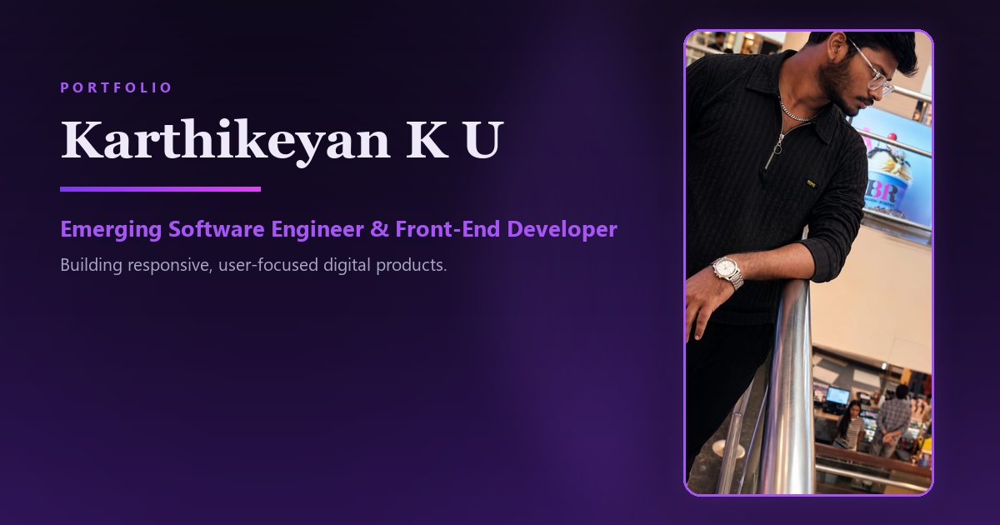

Karthikeyan K U — Personal Portfolio

Emerging Software Engineer · Front-End Developer · UI/UX Enthusiast

A modern, responsive personal portfolio website showcasing my education, internship experience, technical skills, projects, achievements, certifications, resume, and contact information.

About the Project

This portfolio represents my journey as a Computer Science and Engineering undergraduate, front-end developer, and aspiring software engineer.

It is designed to provide recruiters, collaborators, and visitors with a clear overview of my:

Technical skills and development interests

Academic background

Internship experience

Front-end, Java, Python, and UI/UX projects

Achievements and professional certifications

Resume and contact information

The website uses a modern dark visual style, responsive layouts, smooth interactions, and structured content to create a professional user experience across desktop, tablet, and mobile devices.

Live Website

Portfolio:https://portfolio-karthikeyan-k-u.pages.dev/

Key Features

Fully responsive and mobile-friendly design

Modern dark-themed user interface

Smooth scrolling, transitions, and interactive effects

Professional hero and About Me sections

Internship experience showcase

Featured projects section

Dedicated project archive page

Project filtering by technology and category

Skills and technology showcase

Education timeline

Achievements and honours section

Searchable certifications section

Featured certification filter

Downloadable resume

Contact form that opens the visitor's email application

GitHub and LinkedIn integration

Open Graph and Twitter metadata for social sharing

Custom portfolio preview image for link sharing

SEO-friendly page title and description

Cloudflare Pages deployment

Website Sections

Home

Introduces me as an emerging software engineer and front-end developer, with quick access to my projects and resume.

About

Provides information about my academic journey, technical interests, development experience, certifications, and career goals.

Experience

Highlights my web development internship at ATC Travelzone, including responsive interface development, Supabase integration, debugging, and Cloudflare deployment.

Projects

Showcases selected projects across:

Front-End Development

Java and Object-Oriented Programming

Java Swing

Python

UI/UX Design

A separate project archive allows visitors to browse and filter all projects.

Skills

Displays the technologies and tools I use for designing, developing, testing, and deploying applications.

Education

Presents my academic background, including:

B.E. Computer Science and Engineering

BS in Data Science and Applications — IIT Madras

Achievements

Highlights academic and technical milestones, including NPTEL achievements and other recognitions.

Certifications

Contains a searchable collection of certifications in programming, development, cloud technologies, user experience, and artificial intelligence.

Resume

Allows recruiters and visitors to view or download my latest resume.

Contact

Provides direct access to email, GitHub, LinkedIn, and a contact form for internship, collaboration, and professional opportunities.

Technologies Used

Technology

Purpose

HTML5

Website structure and semantic content

CSS3

Styling, responsive layout, animations, and visual effects

JavaScript

Interactivity, filtering, search, navigation, and dynamic behaviour

Responsive Web Design

Support for desktop, tablet, and mobile screens

Cloudflare Pages

Hosting and deployment

Git and GitHub

Version control and source-code management

Project Structure

Personal-Portfolio---Karthikeyan-K-U-/
│
├── final/
│   ├── index.html
│   ├── projects.html
│   ├── profile-about.jpg
│   ├── og-image.png
│   ├── favicon.ico
│   ├── favicon.png
│   └── resume PDF
│
└── README.md

The exact file structure may be extended when new projects, images, certificates, or portfolio features are added.

Run Locally

1. Clone the repository

git clone https://github.com/Karthikeyan-k-u/Personal-Portfolio---Karthikeyan-K-U-.git

2. Open the project directory

cd Personal-Portfolio---Karthikeyan-K-U-

3. Open the website folder

cd final

4. Run the website

Open index.html directly in a browser, or use the Live Server extension in Visual Studio Code.

Using VS Code Live Server is recommended because it provides automatic browser refresh while editing.

Deployment

The portfolio is deployed using Cloudflare Pages.

Cloudflare Pages deployment settings

Framework preset: None
Build command: Leave empty
Build output directory: final

After connecting the GitHub repository to Cloudflare Pages, every new push to the main branch can automatically trigger a fresh deployment.

Responsive Design

The website is designed to work across:

Desktop computers

Laptops

Tablets

Android devices

iPhones and other mobile devices

The layout, typography, navigation, project cards, certification content, images, and contact elements adapt according to the available screen size.

SEO and Social Sharing

The portfolio includes metadata for:

Search-engine descriptions

Canonical URLs

Open Graph previews

Twitter/X card previews

Portfolio preview image

Author and keyword information

Browser favicons

These improvements help the portfolio appear more professionally when shared through LinkedIn, WhatsApp, X, and other platforms.

Author

Karthikeyan K U

Computer Science and Engineering undergraduate focused on front-end development, Java, Python, UI/UX, software engineering, and data-driven applications.

Portfolio: portfolio-karthikeyan-k-u.pages.dev

GitHub: github.com/Karthikeyan-k-u

LinkedIn: linkedin.com/in/karthikeyan-k-u-689858386

Location: Chennai, Tamil Nadu, India

Opportunities

I am open to:

Software development internships

Front-end development opportunities

Java and Python projects

UI/UX collaborations

Open-source contributions

Student developer communities

Data science and software engineering opportunities

Support

If you find this portfolio useful or like the design, consider giving the repository a star.

Designed and developed by Karthikeyan K U

© 2026 Karthikeyan K U. All rights reserved.

